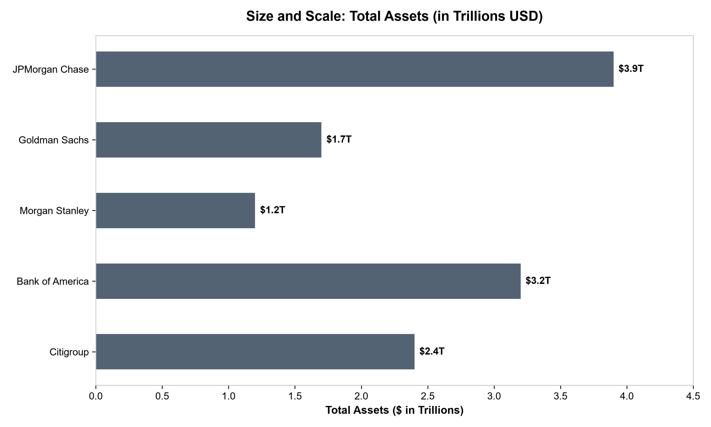
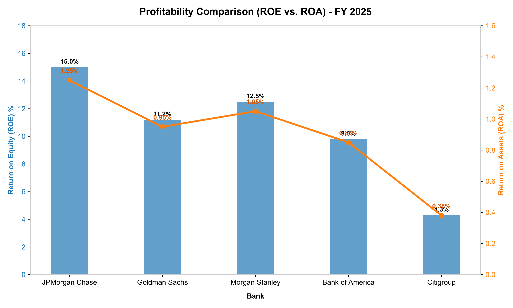
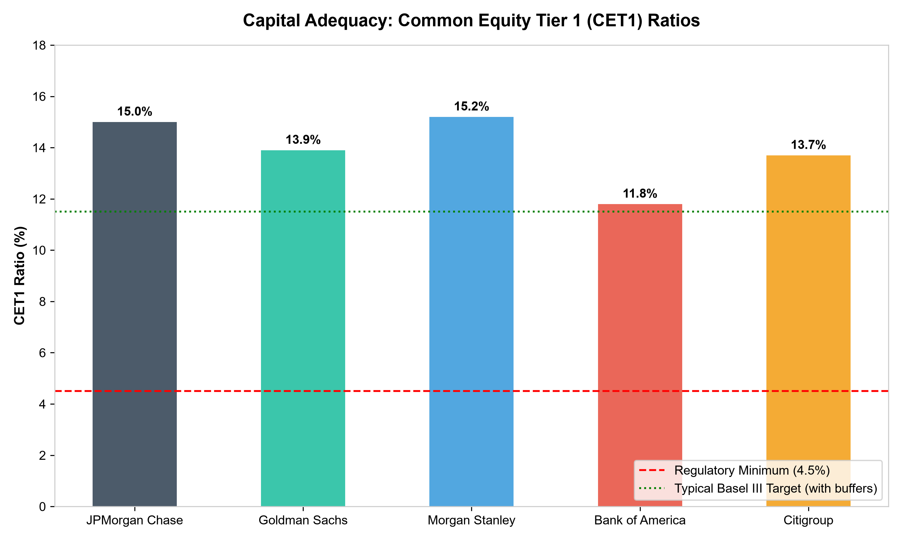

# Bulge Bracket Investment Banks: Comparative Financial Analysis (FY 2025)

This report provides a comprehensive, comparative financial analysis of the five major bulge bracket investment banks—**JPMorgan Chase (JPM)**, **Goldman Sachs (GS)**, **Morgan Stanley (MS)**, **Bank of America (BAC)**, and **Citigroup (C)**. The analysis evaluates key performance and health metrics, including size and scale, profitability, capital adequacy, and risk management.

---

## 1. Executive Summary

As of the end of Fiscal Year 2025, the major bulge bracket banks exhibit highly distinct strategic positioning and financial performance:
*   **JPMorgan Chase** continues to act as the industry leader, displaying unrivaled scale coupled with best-in-class profitability metrics.
*   **Morgan Stanley** and **Goldman Sachs** represent pure-play and hybrid investment banking/wealth management business models, with Morgan Stanley leveraging its wealth management division for high-ROE stability and Goldman Sachs showcasing highly volatile, but strong, capital market performance.
*   **Bank of America** represents a massive consumer and commercial franchise, exhibiting solid capital metrics but squeezed profitability due to lower interest margins.
*   **Citigroup** remains in a multi-year restructuring and transformation phase, showing depressed profitability but solid capital buffers.

---

## 2. Size and Scale: Total Assets

Size and scale are essential indicators of systemic importance and balance sheet capacity. JPMorgan Chase maintains its lead as the largest bank in the United States, followed by Bank of America.

| Bank | Ticker | Total Assets ($ in Trillions) | Primary Business Model Focus |
| :--- | :---: | :---: | :--- |
| **JPMorgan Chase** | JPM | $3.9T | Universal (Commercial, Retail, Investment Banking, Wealth) |
| **Bank of America** | BAC | $3.2T | Universal (Strong Retail, Commercial Banking, Investment) |
| **Citigroup** | C | $2.4T | Global Corporate, Transaction Services, Hybrid Retail |
| **Goldman Sachs** | GS | $1.7T | Capital Markets, Institutional, Specialized Asset Management |
| **Morgan Stanley** | MS | $1.2T | Wealth & Asset Management, Capital Markets |

---

## 3. Profitability: ROE and ROA

Profitability is measured primarily through **Return on Equity (ROE)** and **Return on Assets (ROA)**. JPMorgan Chase and Morgan Stanley outperform their peers, while Citigroup lags significantly due to ongoing restructuring expenses and legal cleanups.

### Key Metrics Table:
*   **ROE (Return on Equity):** Measures how effectively the bank generates returns for its shareholders.
*   **ROA (Return on Assets):** Measures the efficiency of the bank's total asset allocation.

| Bank | Net Income (FY 2025) | Return on Equity (ROE) | Return on Assets (ROA) | Efficiency Ratio |
| :--- | :---: | :---: | :---: | :---: |
| **JPMorgan Chase** | $49.5 Billion | 15.0% | 1.25% | 58.2% |
| **Morgan Stanley** | $11.8 Billion | 12.5% | 1.05% | 71.0% |
| **Goldman Sachs** | $10.5 Billion | 11.2% | 0.95% | 64.5% |
| **Bank of America** | $26.2 Billion | 9.8% | 0.85% | 63.8% |
| **Citigroup** | $7.8 Billion | 4.3% | 0.38% | 74.2% |

### Strategic Observations:
1.  **JPMorgan's Dominance:** JPM's high ROE of 15.0% is driven by strong net interest income and dominant trading/advisory fees.
2.  **Morgan Stanley's Wealth Buffer:** Morgan Stanley's ROE of 12.5% is supported by steady, recurring wealth management advisory fees, which are less capital-intensive and less volatile than Goldman's trading-heavy business.
3.  **Goldman's Capital Markets Focus:** Goldman Sachs exhibits solid 11.2% ROE, recovering from previous consumer-banking headwinds by refocusing on its core investment banking and asset management divisions.
4.  **Citigroup's Restructuring Trap:** Citigroup's low ROE of 4.3% reflects massive legacy asset write-downs, corporate divestitures, and expensive administrative modernization.

---

## 4. Capital Adequacy: Common Equity Tier 1 (CET1) Ratios

Capital adequacy is the key indicator of a bank's resilience to financial shocks. The **Common Equity Tier 1 (CET1) Ratio** measures a bank’s core equity capital against its risk-weighted assets. Basel III standards require a regulatory minimum of 4.5%, with additional systemic buffers bringing the typical target to around 11.5% for systemically important financial institutions (G-SIBs).

*   **Morgan Stanley (15.2%)** and **JPMorgan Chase (15.0%)** hold the strongest capital buffers, significantly exceeding regulatory requirements. This capital strength enables them to pursue active share buybacks and pay solid dividends.
*   **Citigroup (13.7%)** maintains a surprisingly high CET1 ratio, which is a defensive strategy required by its ongoing transition and elevated risk profile.
*   **Goldman Sachs (13.9%)** has rebuilt its capital position after winding down its consumer lending portfolio.
*   **Bank of America (11.8%)** is closer to the industry threshold, reflecting a massive portfolio of long-term low-yield securities that hold unrealized losses.

---

## 5. Risk and Health Profile

Evaluating risk involves examining non-performing loans, liquidity coverage ratios (LCR), and the proportion of Risk-Weighted Assets (RWA) to total assets.

| Bank | Liquidity Coverage Ratio (LCR) | Risk-Weighted Assets / Total Assets | Non-Performing Loan (NPL) Ratio | Leverage Ratio |
| :--- | :---: | :---: | :---: | :---: |
| **JPMorgan Chase** | 140% | 45.2% | 0.52% | 6.8% |
| **Bank of America** | 134% | 51.5% | 0.68% | 5.9% |
| **Citigroup** | 122% | 48.3% | 1.15% | 5.5% |
| **Goldman Sachs** | 128% | 38.5% | 0.45% | 5.2% |
| **Morgan Stanley** | 131% | 34.2% | 0.38% | 5.4% |

### Risk Analysis Insights:
*   **Asset Quality:** Morgan Stanley and Goldman Sachs have the lowest NPL ratios (0.38% and 0.45% respectively) because they do not have large retail credit card or mortgage portfolios, which are more susceptible to consumer defaults.
*   **Leverage vs. Risk-Weighting:** Goldman Sachs and Morgan Stanley have lower RWA/Total Asset percentages, indicating a higher concentration of liquid, market-making assets rather than long-term commercial loans.
*   **Liquidity Cushion:** JPMorgan Chase boasts the highest LCR at 140%, indicating a massive surplus of high-quality liquid assets (HQLA) ready to meet any sudden deposit runs.

---

## 6. Strategic Conclusions

1.  **Best Overall Performer:** **JPMorgan Chase (JPM)** continues to demonstrate why it is considered the gold standard of global banking, excelling in scale, profitability, capital, and risk management.
2.  **Best Wealth Play:** **Morgan Stanley (MS)** offers a highly stable, high-margin asset management model that is less cyclical and less capital-intensive than traditional investment banking.
3. **Turnaround Play:** **Hash/Pattern and Citigroup (C)** remains a deep-value turnaround opportunity. Once its restructuring is complete and ROE rises toward its 10% target, it could see substantial valuation rerate.
4. **Pure Capital Markets Play:** **Goldman Sachs (GS)** remains the most leveraged to capital market recoveries, making it highly profitable during M&A and trading booms, but volatile in downturns.
